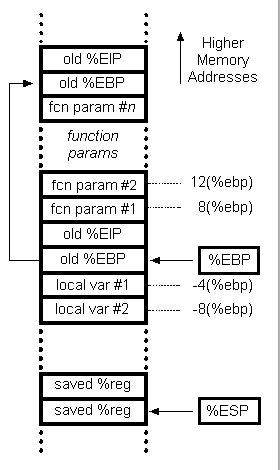

# Function-call Conventions
## 目录
- 1.前言
- 2.基础知识
- 3.例子及分析
- 4.函数调用约定
- 5.Reference
### 1.前言
作为一个程序猿，怎么能不懂函数调用呢？不就是调用函数向被调函数传入参数，被调函数返回结果嘛，哦！真的有那么简单吗，额...好吧其实就是这样，但是我们要深入底层去看看在操作系统内核层面都发生了些什么事情。
### 2.基础知识
先来复习一下基础知识，以便理解反汇编代码。
__stack__
一个很基础的数据结构，就是有__push/pop__只允许在一端进行操作，还有其他的一些特点就不说了，就是这个很基础的数据结构，构成了计算机中程序执行的基础，用于内核中程序执行的栈具有以下特点：
- 每一个进程在用户态对应一个调用栈结构(call stack)
- 程序中没一个未完成运行的函数对应一个栈帧(stack frame,有些地方译为栈框)，其中保存函数局部变量，传递给被调函数的参数等信息
- 栈底对应高地址，栈顶对应低地址，栈由内存高地址向低地址延伸
一个进程的调用栈如下图：

__register__
寄存器位于cpu内部，用于存放程序执行中用到的数据和指令，cpu从寄存器中取数据，相比从内存中取快的多。寄存器分为通用寄存器与特殊寄存器。
通用寄存器有__ax/bx/cx/dx/di/si__，这些寄存器在大多数指令中可以任意使用，也有一些规定某些指令只能用于某个特定“__通用__”寄存器，例如函数返回时需要将返回值mov到ax寄存器中
特殊寄存器中有__bp/sp/ip__等，特殊寄存器有特定用途，例如__sp__寄存器用于存放栈帧地址，不用与存放局部变量。
- __ax(accumulator)__:可用于存放函数返回值
- __bp(base pointer)__:用于存放执行中的函数对应的栈帧的栈底地址
- __sp(stack pointer)__:用于存放执行中的函数对应的栈帧的栈顶地址
- __ip(instruction pointer)__:指向当前执行指令的下一条指令地址
不同架构的cpu，寄存器名称有不同的前缀表示寄存器的大小，`x86`架构使用__e__作为前缀，表示各寄存器大小为32位，对于`x86_64`架构，使用__r__作为前缀，表示各寄存器大小为64位。
### 3.例子及分析
__例子程序__
```
int foo(int c, int d){
        int e = c + d;
        return e;
}
int main(){
        foo(1,2);
        return 0;
}
```
__反汇编分析(使用gdb)__
```
(gdb) disas /rm
Dump of assembler code for function main:
5       int main(){
   0x0000000000400507 <+0>:     55      push   %rbp
   0x0000000000400508 <+1>:     48 89 e5        mov    %rsp,%rbp

6               foo(1,2);
=> 0x000000000040050b <+4>:     be 02 00 00 00  mov    $0x2,%esi
   0x0000000000400510 <+9>:     bf 01 00 00 00  mov    $0x1,%edi
   0x0000000000400515 <+14>:    e8 d3 ff ff ff  callq  0x4004ed <foo>

7               return 0;
   0x000000000040051a <+19>:    b8 00 00 00 00  mov    $0x0,%eax

8       }
   0x000000000040051f <+24>:    5d      pop    %rbp
   0x0000000000400520 <+25>:    c3      retq   

End of assembler dump.
```
`disas`命令的`/m`指示显示汇编指令的同时，显示相应的程序源码;`/r`指示显示十六进制的计算机指令
__解释一下反汇编代码每一列的含义__
1. `0x0000000000400507`:对应指令的虚拟内存地址
2. `<+0>`:对应指令的虚拟内存地址偏移量
3. `55`:指令对应的计算机指令
4. `push %rbp`:汇编指令
从反汇编出来的代码看出一个函数调用，首先要完成这些动作：
- 将调用栈的栈帧底地址入栈，即`push %rbp`
- 建立新的栈帧，将被调用的栈帧栈底指针放入`bp`寄存器中，即`mov %rsp %rbp`
你可能会说，难道`main`函数不是第一个调用的吗?还需要被调用?难道`main`函数也是被调函数?是这样的，使用`gcc`编译的程序其实是由`crt1.o`的`_start`函数拉起，调用我们程序中的`main`函数，从而使我们的程序运行起来，而这个动作是在进行__链接__的时候实现的。
函数调用通常会涉及到参数的传递，这时需要借助通用寄存器进行传递，如上面的反汇编分析中的：
```
mov     $0x2,%esi
mov     $0x1,%edi
```
__对于参数传递的方式__，`x86`和`x86_64`有不同的调用规定，具体下一节中详解，`x86_64`将参数传入通用寄存器，`x86`将参数压入调用栈中，如下：
```
sub     $0x8,%esp
mov     $0x5,-0x4(%ebp)
mov     $0x2,-0x8(%ebp)
```
参数的调用栈位置是通过`ebp`保存的栈帧底地址索引，栈从内存高地址向低地址延伸，所以为负索引，减小`esp`寄存器的值表示扩展栈帧。   0x0000000000400515 <+14>:    e8 d3 ff ff ff  callq  0x4004ed <foo>
好了，参数准备好了，可以调用函数了，`call`指令完成调用函数交接的任务：
```
0x0000000000400515 <+14>:    e8 d3 ff ff ff  callq  0x4004ed <foo>
```
`call`__指令完成两个任务：__
- 将调用函数(main)中的下一条指令(0x000000000040051a)入栈，被调函数返回后取这条指令继续执行，64位`rsp`寄存器的值减8
- 修改指令指针寄存器`rip`的值，指向被调函数(foo)的执行位置，及`0x4004ed`

我们先查看一下`rbp,rsp,rip`寄存器的值
```
(gdb) info registers rbp rsp
rbp            0x7fffffffdac0   0x7fffffffdac0
rsp            0x7fffffffdac0   0x7fffffffdac0
(gdb) info registers rip
rip            0x40050b 0x40050b <main+4>
```
执行`si 3`后查看`rbp,rsp,rip`寄存器的值
```
(gdb) info registers rbp rsp rip
rbp            0x7fffffffdac0   0x7fffffffdac0
rsp            0x7fffffffdab8   0x7fffffffdab8
rip            0x4004ed 0x4004ed <foo>
```
可以看到`rsp`在执行了`call`后减8，`rip`的值则指向了`foo`函数的执行位置。
__好了现在开始执行foo函数__
```
(gdb) disas /rm
Dump of assembler code for function foo:
1       int foo(int c, int d){
=> 0x00000000004004ed <+0>:     55      push   %rbp
   0x00000000004004ee <+1>:     48 89 e5        mov    %rsp,%rbp
   0x00000000004004f1 <+4>:     89 7d ec        mov    %edi,-0x14(%rbp)
   0x00000000004004f4 <+7>:     89 75 e8        mov    %esi,-0x18(%rbp)

2               int e = c + d;
   0x00000000004004f7 <+10>:    8b 45 e8        mov    -0x18(%rbp),%eax
   0x00000000004004fa <+13>:    8b 55 ec        mov    -0x14(%rbp),%edx
   0x00000000004004fd <+16>:    01 d0   add    %edx,%eax
   0x00000000004004ff <+18>:    89 45 fc        mov    %eax,-0x4(%rbp)

3               return e;
   0x0000000000400502 <+21>:    8b 45 fc        mov    -0x4(%rbp),%eax

4       }
   0x0000000000400505 <+24>:    5d      pop    %rbp
   0x0000000000400506 <+25>:    c3      retq   

End of assembler dump.
```
前两条指令将`main`函数的栈底入栈，建立`foo`函数的栈，然后将`edi,esi`中的参数取出，这里没有将其放入栈中，是因为这次函数调用是最后一次调用了，变量没有保存的必要，然后将参数取出到`eax,edx`中，进行运算，结果存入`eax`寄存器中，作为返回值返回，最后这里比较特殊，因为这次函数调用没有扩充栈，所以`}`后调用的是：
```
pop     %rbp
retq
```
如果扩充了栈的话，这里就应该是：
```
leaveq
retq
```
`leaveq`这里执行了两条指令：
```
mov     %rbp,%rsp
pop     %rbp
```
这里就把`rbp,rsp`的内容还原为函数调用前的状态，`retq`则负责修改`rip`的值，将其恢复为原函数栈帧中将要执行的指令地址。
这样一次函数调用就完成了。
### 4.函数调用约定

### 5.Reference
- [Intel x86 Function-call Conventions - Assembly View](http://www.unixwiz.net/techtips/win32-callconv-asm.html)
- [main函数和启动例程](http://docs.linuxtone.org/ebooks/C&CPP/c/ch19s02.html)
- [函数调用过程探究](http://www.cnblogs.com/bangerlee/archive/2012/05/22/2508772.html)
__注：编程环境：openSUSE-42.2，gcc-4.8.5，gdb-7.11.1，反汇编代码为AT&T风格__
