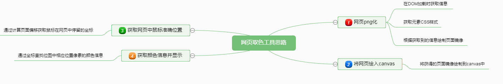
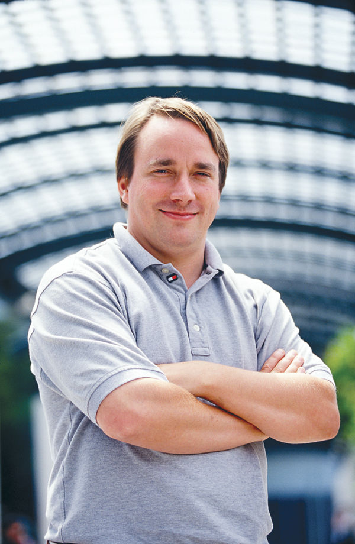

#Canvas取色Demo
---
##内容导读
		1.取色Demo展示及原理
		2.Canvas简介以及一些Demo
		3.题外话
##1.取色器Demo及其原理
>思维导图

##2.Canvas简介及一些Demo
>HTML5`<canvas>`元素用与网页中图形的绘制，通过脚本(javascript)来完成，`<canvas>`标签只是图形容器，必须使用脚本来绘图

>常用方法

>- moveTo(x, y)
>- lineTo(x, y)

	使用这个方法我们可以画一些东东，比如：

<canvas id="canvas-1" width="400" height="400"></canvas>
<canvas id="canvas-2" width="400" height="400">
	不支持canvas的浏览器就会显示
</canvas>

	还有一些更高大上的方法
	#quadraticCurveTo(cp1x, cp1y, x, y)
	(cp1x, cp1y)--控制点
	这个函数用于从当前画笔位置，到(x, y)处画一条二次曲线
	#bezierCurveTo(cp1x, cp1y, cp2x, cp2y, x, y)
	从当前位置到(x, y)画一条贝塞尔曲线
	我们看看他能画啥:

<canvas id="canvas-3" width="400" height="200"></canvas>
<canvas id="canvas-4" width="400" height="200"></canvas>

##3.题外话(装个x)

>Linus Benedict Torvalds

>他想写个操作系统，就写出了**Linux**

>他嫌合并世界各地提交的代码太麻烦，就写出了**Git**

>他说Just For Fun

>做你感兴趣的

